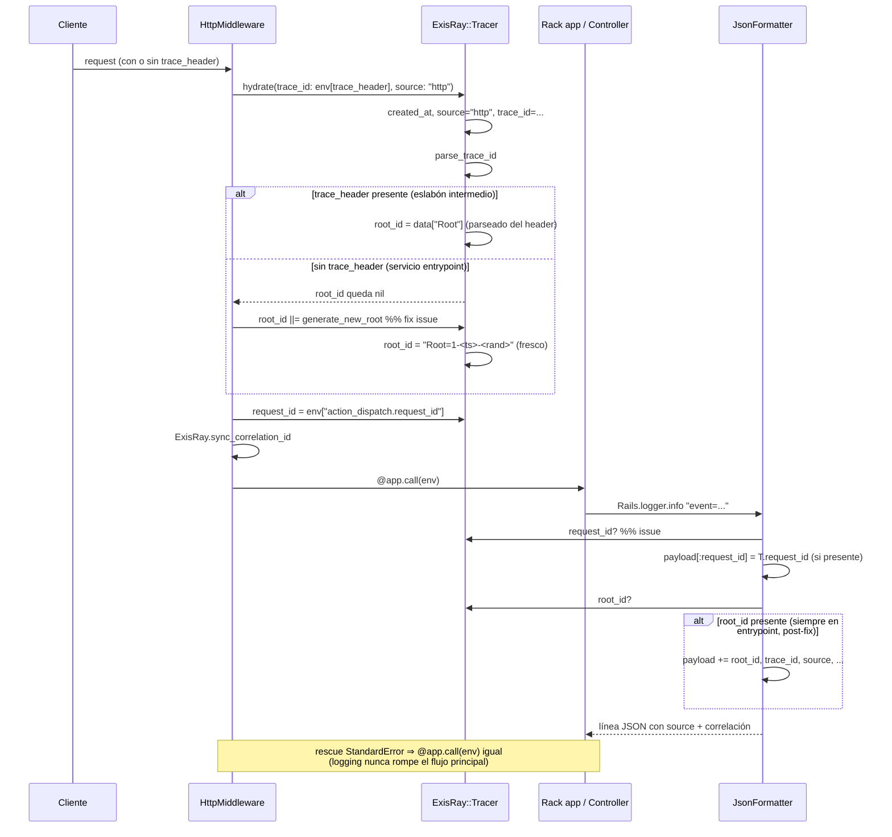

# Comportamiento — exis_ray

> meta: artefacto · RFC-007 (UML 2.x sequence / BPMN 2.0, render Mermaid) · generado dev-enrich · anclado a commit `00cf803` (v0.8.0 + fix issue #9) · cobertura **parcial incremental**

## 1. Resumen

Comportamiento runtime de la trazabilidad distribuida: hidratación del `Tracer` en cada entrypoint y emisión del contexto en cada línea de log. Documentación **incremental** — este artefacto se inició con el PR del issue #9 (flujo de entrypoint HTTP); el resto de flujos se acreta cuando se tocan.

## 2. Cuerpo

### Cobertura (obligatoria — RFC-007 §2.a)

| Flujo | Estado | Origen |
|---|---|---|
| Hidratación de trace en entrypoint HTTP + emisión en logs | **documentado** | PR issue #9 |
| Hidratación en entrypoint Sidekiq (server middleware) | **referenciado** (no diagramado) | — |
| Hidratación en entrypoint BugBunny consumer | **referenciado** (no diagramado) | — |
| Hidratación en entrypoint TaskMonitor (Rake/Cron) | **referenciado** (no diagramado) | — |
| Propagación saliente (Faraday / ActiveResource / BugBunny publisher) | **NO documentado** | — |
| Ciclo de vida RPC reply (BugBunny) | **NO documentado** | — |

Ausencia de un flujo en este artefacto ≠ inexistencia del flujo. Acreta por PR.

### Flujo: Hidratación de trace en entrypoint HTTP + emisión en logs

Invariante de paridad: los 4 entrypoints (`HttpMiddleware`, `Sidekiq::ServerMiddleware`, `BugBunny::ConsumerTracingMiddleware`, `TaskMonitor`) garantizan un `root_id` aunque no llegue trace header entrante. Antes del fix de issue #9, `HttpMiddleware` era el único sin ese fallback: un servicio que es **punto de entrada** (no eslabón intermedio) emitía logs sin `root_id`, y por efecto cascada sin `source` (campo mandatorio del estándar Wispro).

Contexto: `JsonFormatter#inject_tracer_context` corta todo su bloque con `return unless root_id` (Gap B — efecto cascada de Gap A). El fix de Gap A (root fresco en `HttpMiddleware`) des-gatea ese bloque y `source` vuelve a emitirse. `request_id` se emite **fuera** de ese guard (Gap C): tiene distinto ciclo de vida que `root_id` (UUID v4 de Rails vs formato X-Ray) y un servicio puede querer correlación por request aunque no haya trace context.

## 3. Inferencias

| Afirmación | confidence | a verificar por humano |
|---|---|---|
| Los 4 entrypoints comparten la invariante "siempre hay root_id" | `declared` | código de los 4 middlewares lo confirma (issue #9 lo tabula) |
| `request_id` no se emitía en ninguna línea pre-fix | `declared` | confirmado: `JsonFormatter` solo lo usaba interno vía `clean_request_id` |
| Orden de emisión (request_id antes del guard de root_id) | `declared` | `json_formatter.rb#inject_tracer_context` post-fix |

## 4. Cobertura y fronteras

- **Incremental:** solo el flujo de entrypoint HTTP está diagramado. Sidekiq/BugBunny/TaskMonitor referenciados por paridad pero no diagramados (acretan cuando se toquen).
- **Fuera de alcance:** estructura de datos (gema sin DB → no aplica), interfaz Ruby pública / topología (capas F2 de `dev-structure`, no implementadas).
- **Significado de términos** (`root_id`, `source`, etc.) → `docs/glossary/glossary.md`.
